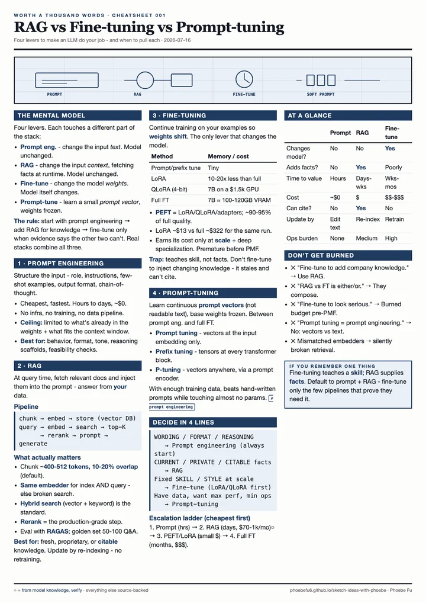

# Worth a thousand words

Data and AI, explained in pictures. I lead data teams by day and draw
what's hard to say - complicated business, data, and data people,
simplified into images anyone can act on. Every prompt published.

**5 works · 4 styles · 4 tools · every prompt is yours to copy**

🖼️ **[Enter the gallery →](https://phoebefu6.github.io/sketch-ideas-with-phoebe/)**

## Latest

<table><tr><td width="33%"></td><td width="33%"></td><td width="33%"></td></tr><tr><td align="center"><b>RAG vs Fine-tuning vs Prompt-tuning</b> · html-render</td><td align="center"><b>The minds of modern AI</b> · chatgpt</td><td align="center"><b>The forecast, quarterly (sample - replace with real work)</b> · nano-banana</td></tr></table>

<table><tr><td width="33%"></td><td width="33%"></td></tr><tr><td align="center"><b>Half-truth dashboard mark (sample - replace with real work)</b> · chatgpt</td><td align="center"><b>Lake or swamp (sample - replace with real work)</b> · midjourney</td></tr></table>

## Formats

- **Infographic** (2) - A complex data/AI concept, explained in one image.
- **Chart** (0) - One chart, one idea - single-chart experiments, d3.js spirit. Never a dashboard.
- **Data portrait** (0) - One number or stat as the hero - the two-second rule made visible.
- **Diagram** (0) - A system, pipeline, or architecture drawn as designed art, not a boxes-and-arrows dump.
- **Timeline** (0) - How a concept, tech, or idea evolved - time as the spine.
- **Map** (0) - A concept as territory - a landscape or transit-map of an idea space.
- **Matrix** (0) - A 2x2 or quadrant framework - a decision or trade-off made spatial.
- **Isotype** (0) - Quantity shown by repeating identical pictograms - more units, never a bigger icon.
- **Annotated** (0) - A chart, screenshot, or artifact with labels pointing straight at the meaning.
- **Field guide** (0) - A naturalist plate cataloguing the "species" of a data/AI thing.
- **Comic** (1) - Strips that teach a real lesson.
- **Poster** (0) - One bold visual metaphor for a data/AI idea.
- **Typographic** (0) - Type IS the image - words as the whole composition.
- **Carousel** (0) - Multi-slide explainers for concepts that need pacing.
- **Zine** (0) - An editorial spread or mini-page - print-craft applied to one idea.
- **Card** (0) - A compact shareable image with one sharp idea.
- **Cheatsheet** (1) - One page, 80% of what matters - a topic distilled and designed to keep.
- **Ironic graph** (0) - Charts that tell the truth by exaggerating it.
- **Illustration** (0) - Data and AI ideas as scenes and characters.
- **Logo** (1) - Marks and identity for data/AI things.
- **Style study** (0) - The sketchbook - mimicking a beautiful style to learn it.

## How this repo works

- `works/` holds one folder per image: the original, `meta.yml`, optional `idea.md`, and an auto thumbnail.
- `scripts/build.py` regenerates thumbnails, `data/works.js`, `CATALOG.md`, and this README.
- Private inspiration notes live in ignored folders like `inbox/` or `private/`.
- New work = drop one folder, run the build, push. Nothing else is ever edited by hand.

Made with Midjourney, ChatGPT image, Nano Banana - and strong opinions about data.
